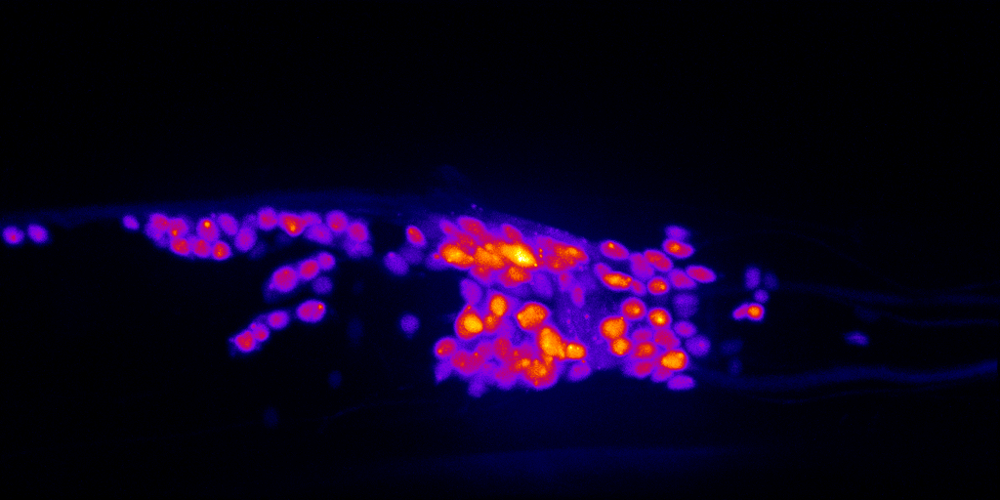
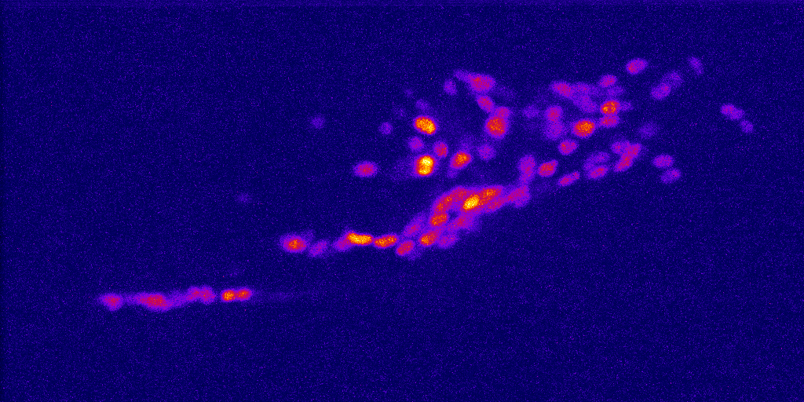
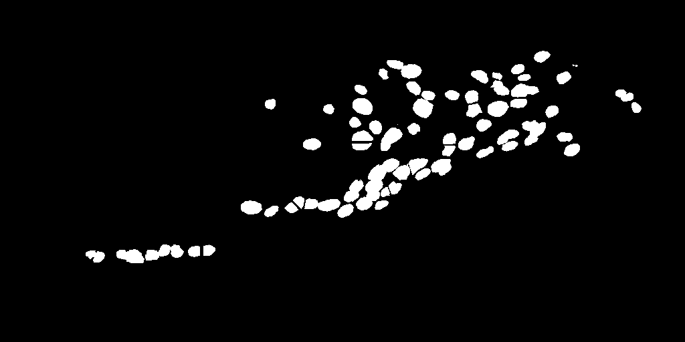
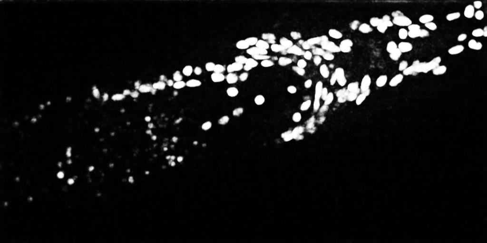
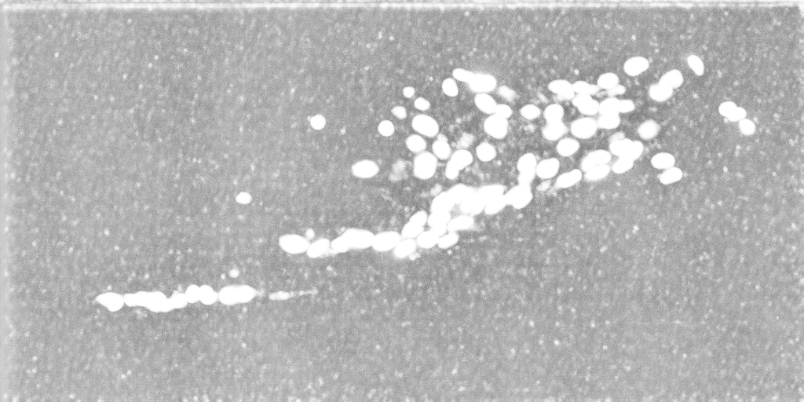
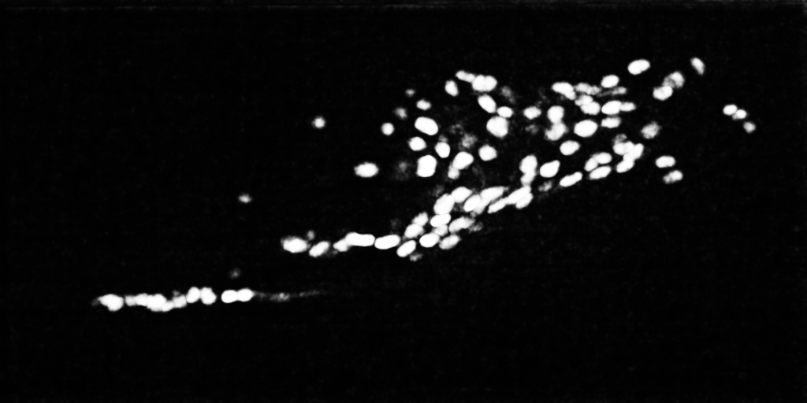
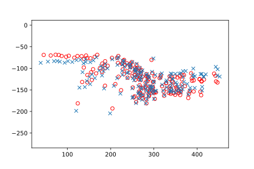
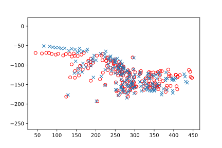
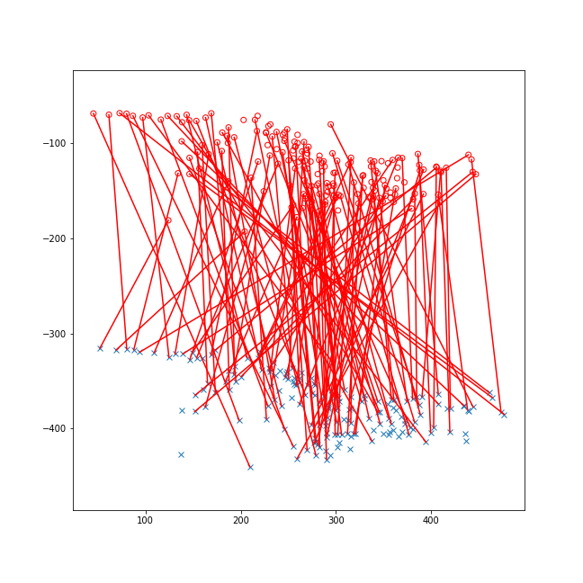
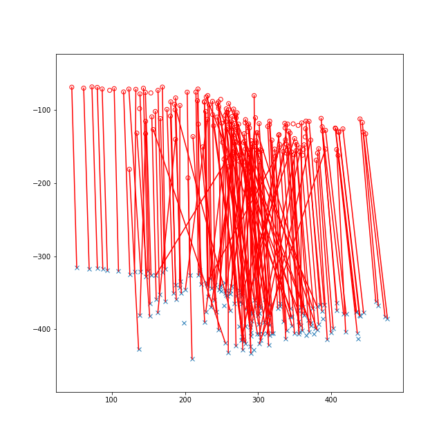

## Use 3DeeCellTracker in Spyder
The python scripts in this folder were used to generate the results we published in eLife 2021,
but they have been deprecated because the newer version is more convenient to use and quicker.

- We archived these old scripts here for backup.
- In order to use these scripts please install the old version of 3DeeCellTracker v0.2 by: 
  ```
  $ pip install 3DeeCellTracker==0.2
  ```

### 1 Tracking Using IDE (Spyder):
#### 1.1 Preparations: 
We suggest that users should use an IDE such as Spyder to run the "cell_segment_track.py" under "./Tracking/".

1. Modify following path and file names in "cell_segment_track.py", including: 
- "folder_path" (containing data, models and segmetation/tracking results),  
- "files_name"(of raw images), 
- "unet_weight_file" (name of 3D U-net weight file)
- "FFN_weight_file" (name of FFN weight file)
2. Put raw images into "data" folder and unet and FFN weight files into "models" folder.
3. Modify global parameters (see the [user-guide for setting parameters](https://github.com/WenChentao/3DeeCellTracker/blob/master/Guide%20for%20parameters.md)).
#### 1.2 Procedures for tracking:
##### 1.2.1 Segmentation of volume #1
Run the code in "cell_segment_track.py" until finishing "automatic segmentation of volume #1". The resulted segmentation is stored into the folder “auto_vol1”

| Raw image | Segmentation result |
| ------------- | ------------- | 
|  |  |

 (Optional) Users can check the segmentation in Fiji. Here are the 2D projected raw images in volume #1 (left, color = “fire”; images 1-21) and segmentation results (right, color = “3-3-2 RGB”): 
 
##### 1.2.2 Manually correct the segmentation in volume #1 
Users should correct the segmentation in other software such as ITK-SNAP. For the demo data, we have included the corrected segmentation in folder “manual_vol1”. Here is the 2D projection of our corrected segmentation:


##### 1.2.3 Track cells in all volumes
Run "cell_segment_track.py" to the end. The tracked labels are stored into the folder “track_results”. 


(Optional) Users can check the tracking results in Fiji by comparing the raw images and tracked labels:

Users can use other software for checking the results, such as in IMARIS.

### 2 Training 3D U-net in Spyder
#### 2.1 Preparations: 
For training 3D U-net, users should run "unet_training.py" under "./UnetTraining/".

Again, users should modify the "folder_path" (containing following data and results), put training data (image and annotations) into "train_image" and "train_cells" folder, respectively, and put validation data (image and annotations) into "valid_image" and "valid_cells" folder, respectively. 

In the demo data, we have supplied necessary image data for training and validation (see below). 

Training data (Projected to 2D plane):
| Raw image (color = "fire") | Cell image (binary value) |
| ------------- | ------------- | 
|  |  |

Validation data:
| Raw image | Cell image |
| ------------- | ------------- | 
|  |  |

The structure of the 3D U-net can be modified to existing ones: "unet3_a ", "unet3_b", or "unet3_c". For example, to use the structure "a", we could run following codes: 
```
from CellTracker.unet3d import unet3_a
unet_model = unet3_a() 
```
Users can also define their own structures of 3D U-net in "unet3d.py" under "./UnetTraning/CellTracker/". 
#### 2.2 Procedures for training 3D U-net:
##### 2.2.1 Train the 3D U-net
Users should run the codes until finishing training the 3D U-net. Here we trained 30 epochs (30 cycles). Users can increase the number of epochs if they wish to obtain a more accurate model. 

To show the history of the errors during training by authors, we plotted the loss function (binary cross-entropy) on training data and validation data (figure below).

Notice the training process will be different every time owning to randomness, but users should observe a quick decrease of loss though early stage of training.


##### 2.2.2 Check the prediction of the U-net 
The loss function gives us a quantitative evaluation of the error rates, but we also need an intuitive impression to judge the prediction. 

During training, those weights (parameters of the 3D U-net) with decreased loss were stored for different epochs (here 1-30). Users should first confirm in which epochs weights were stored (in folder "weights"). Then users can load weights and predict cell regions in training and validation images (results are saved in folder "prediction"). Here we show predictions corresponding to 3 different epochs (figure below). Users may obtain different predictions but as a trend the accuracy should be improved gradually. 

Cell regions (following images are probability maps: black:0, white:1) predicted from raw images

(1) For training data. 
| epoch = 1(weight = 1) | epoch = 2 | epoch = 28 |
| ------------- | ------------- | ------------- | 
|  |  |  |

(2) For validation data. 
| epoch = 1 | epoch = 2 | epoch = 28 |
| ------------- | ------------- | ------------- | 
|  |  |  |

### 3 Training the feedforward network in Spyder
#### 3.1 Preparations: 
For training FFN, users should run "FFNTraining.py" under "./FFNTraining/".

Again, users should modify the "folder_path" (containing following data and results) and put two point sets including the training data and test data into "data" folder. In the demo data, we have supplied a point set for training and another point set for test. 

The training data were generated by simulations from the training point set. Here are some typical generated training data examples (Projected to 2D plane): 

Red circles: raw point set. Blue crosses: generated point set with simulated movements.
| example data1 | example data2 | example data3 |
| ------------- | ------------- | ------------- | 
|  |  |  |

#### 3.2 Procedures:
##### 3.2.1 Train the FFN
Users should run the code "FFNTraining.py" to train the FFN. Please note some parameters used in this demonstration are different with the ones used in our paper, in order to make larger movements and to reduce the training time. The default number of epochs for training is 30. Users can increase the epochs to get a more accurate model. We only measured the loss function (binary cross-entropy) on the generated training data (always different in each epoch due to random simulations). 


##### 3.2.2 Check the prediction of FFN on test data
Users can load weights corresponding to different epochs and save predicted matching between the training point set and the test point set (in folder "prediction"). Here we show predictions corresponding to 3 different epochs:

Circles on top: training point set; Crosses on bottom: test point set. Red lines: predicted matching.
| epoch = 1 | epoch = 9 | epoch = 23 |
| ------------- | ------------- | ------------- | 
|  |  |  |
